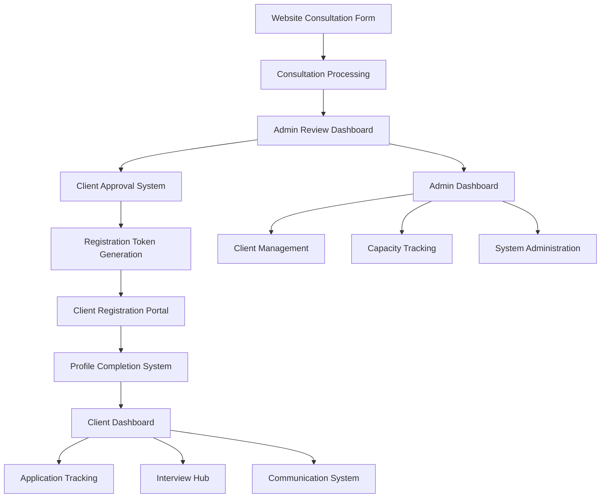

# Design Document: Consultation-to-Client Pipeline

## Overview

The consultation-to-client pipeline system is a comprehensive workflow management platform that transforms consultation requests into fully onboarded clients. The system manages the entire journey from initial consultation submission through client approval, registration, profile completion, and ongoing service delivery.

The architecture supports two distinct user experiences: a client-focused dashboard for tracking personal progress and applications, and an admin dashboard for managing the business pipeline, capacity, and client relationships.

## Architecture

The system follows a multi-layered architecture with clear separation between consultation management, client onboarding, and ongoing service delivery:



### Core Components

1. **Consultation Processing Engine**: Handles initial consultation requests and status management
2. **Admin Review System**: Provides tools for consultation evaluation and client approval
3. **Registration Management**: Manages secure token-based client registration
4. **Profile Completion Tracker**: Guides clients through multi-stage profile setup
5. **Client Dashboard**: Comprehensive client-facing interface
6. **Admin Dashboard**: Business management and client oversight tools
7. **Email Notification System**: Automated communication throughout the pipeline

## Components and Interfaces

### Consultation Processing Engine

**Purpose**: Manages the initial consultation request lifecycle from submission to approval/rejection.

**Key Functions**:
- Consultation request validation and storage
- Status tracking (pending → approved/rejected → registered)
- PDF resume handling and storage
- Integration with email notification system

**Database Tables**:
- `consultation_requests`: Core consultation data
- `consultation_documents`: Associated files and resumes

**API Endpoints**:
- `POST /api/consultations` - Submit consultation request
- `GET /api/consultations` - Admin: List all consultations
- `PATCH /api/consultations/:id` - Admin: Update consultation status

### Registration Management System

**Purpose**: Handles secure client account creation using unique registration tokens.

**Key Functions**:
- Registration token generation and validation
- Secure password creation with strength requirements
- Client account provisioning
- Integration with consultation status updates

**Database Tables**:
- `registration_tokens`: Secure tokens for approved clients
- `clients`: Client account information

**API Endpoints**:
- `GET /api/register/:token` - Validate registration token
- `POST /api/register` - Complete client registration
- `POST /api/auth/login` - Client authentication

### Profile Completion System

**Purpose**: Guides new clients through comprehensive profile setup with progress tracking.

**Key Functions**:
- Profile completion percentage calculation
- Required field validation and tracking
- Document upload management (LinkedIn, preferences, etc.)
- Progressive feature unlocking

**Database Tables**:
- `client_profiles`: Extended client information
- `profile_completion_tracking`: Progress monitoring

**API Endpoints**:
- `GET /api/client/profile` - Get profile completion status
- `PATCH /api/client/profile` - Update profile information
- `POST /api/client/documents` - Upload profile documents

### Application Tracking System

**Purpose**: Comprehensive job application management with progress monitoring against tier-based targets.

**Key Functions**:
- Application CRUD operations
- Status tracking (Applied → Interviewing → Offer/Rejected)
- Weekly volume tracking against tier targets (17/30/50)
- Tailored resume version management

**Database Tables**:
- `applications`: Job application records
- `application_documents`: Tailored resumes and materials
- `client_tiers`: Tier-based service levels and targets

**API Endpoints**:
- `GET /api/applications` - Client: Get personal applications
- `POST /api/applications` - Admin: Add application for client
- `PATCH /api/applications/:id` - Update application status
- `GET /api/applications/stats` - Get progress statistics

### Interview Preparation Hub

**Purpose**: Manages mock interviews, preparation materials, and interview feedback.

**Key Functions**:
- Mock interview scheduling with Google Meet integration
- Role-specific preparation material delivery
- Interview debrief collection and processing
- Admin feedback and next-round guidance

**Database Tables**:
- `mock_interviews`: Scheduled interview sessions
- `interview_materials`: Preparation resources
- `interview_debriefs`: Client feedback after real interviews

**API Endpoints**:
- `GET /api/interviews` - Get scheduled interviews
- `POST /api/interviews` - Admin: Schedule mock interview
- `POST /api/interviews/:id/debrief` - Submit interview feedback
- `GET /api/interviews/materials` - Get preparation materials

### Client Dashboard System

**Purpose**: Comprehensive client-facing interface for tracking progress and accessing services.

**Key Features**:
- Profile completion tracker with visual progress bar
- Active applications table with status indicators
- Weekly volume counter with tier-based targets
- Interview preparation hub with scheduled sessions
- Document vault for optimized resumes
- Admin communication channel

**API Endpoints**:
- `GET /api/client/dashboard` - Get dashboard overview
- `GET /api/client/progress` - Get completion status
- `GET /api/client/messages` - Get admin communications

### Admin Dashboard System

**Purpose**: Business management interface for consultation review, client management, and system administration.

**Key Features**:
- Global overview with capacity tracking
- Consultation review with PDF preview
- Client management workspace
- Application queue management
- Interview coordination tools
- System settings and capacity controls

**API Endpoints**:
- `GET /api/admin/dashboard` - Get admin overview
- `GET /api/admin/capacity` - Get capacity status
- `GET /api/admin/clients/:id` - Get client details
- `POST /api/admin/clients/:id/applications` - Add client application

## Data Models

### Consultation Request Model
```typescript
interface ConsultationRequest {
  id: string;
  full_name: string;
  email: string;
  phone?: string;
  linkedin_url?: string;
  role_targets: string;
  location_preferences: string;
  minimum_salary?: string;
  target_market: string;
  employment_status: string;
  package_interest: 'Tier 1' | 'Tier 2' | 'Tier 3';
  area_of_concern: string;
  consultation_window: string;
  resume_url?: string;
  status: 'pending' | 'approved' | 'rejected' | 'registered';
  admin_notes?: string;
  processed_by?: string;
  processed_at?: Date;
  registration_token?: string;
  created_at: Date;
  updated_at: Date;
}
```

### Client Profile Model
```typescript
interface ClientProfile {
  id: string;
  consultation_id: string;
  email: string;
  password_hash: string;
  first_name: string;
  last_name: string;
  phone?: string;
  linkedin_url?: string;
  resume_url?: string;
  profile_picture_url?: string;
  tier: 'Tier 1' | 'Tier 2' | 'Tier 3';
  target_roles: string[];
  location_preferences: string[];
  minimum_salary?: number;
  preferred_industries: string[];
  years_experience?: number;
  education_level?: string;
  career_goals?: string;
  current_challenges?: string;
  profile_completion_percentage: number;
  status: 'active' | 'inactive' | 'suspended';
  onboarding_completed: boolean;
  created_at: Date;
  updated_at: Date;
}
```

### Application Model
```typescript
interface Application {
  id: string;
  client_id: string;
  company_name: string;
  job_title: string;
  job_url?: string;
  application_date: Date;
  status: 'applied' | 'interviewing' | 'offer' | 'rejected' | 'withdrawn';
  tailored_resume_url?: string;
  cover_letter_url?: string;
  notes?: string;
  admin_notes?: string;
  interview_date?: Date;
  offer_amount?: number;
  created_at: Date;
  updated_at: Date;
}
```

### Mock Interview Model
```typescript
interface MockInterview {
  id: string;
  client_id: string;
  application_id?: string;
  scheduled_date: Date;
  duration_minutes: number;
  meeting_link: string;
  preparation_materials?: string;
  admin_feedback?: string;
  client_debrief?: string;
  status: 'scheduled' | 'completed' | 'cancelled';
  created_at: Date;
  updated_at: Date;
}
```

## Correctness Properties

*A property is a characteristic or behavior that should hold true across all valid executions of a system-essentially, a formal statement about what the system should do. Properties serve as the bridge between human-readable specifications and machine-verifiable correctness guarantees.*

### Property Reflection

After analyzing all acceptance criteria, I identified several areas where properties can be consolidated to eliminate redundancy:

- Email sending properties (1.2, 1.3, 2.5, 2.6, 11.1-11.5) can be combined into comprehensive email notification properties
- Dashboard display properties (2.1, 4.1, 8.1-8.5, 12.1-12.4) can be consolidated into role-based dashboard properties
- Status update properties (2.3, 3.5) can be combined into a comprehensive status transition property
- Data persistence properties (1.4, 3.4, 9.2) can be unified into data integrity properties

### Core Correctness Properties

Property 1: Consultation lifecycle integrity
*For any* consultation request, the system should maintain data integrity throughout the complete lifecycle from submission through registration, ensuring all required fields are preserved and status transitions are valid.
**Validates: Requirements 1.1, 1.4, 1.5, 2.3, 3.5**

Property 2: Email notification consistency
*For any* consultation status change (submitted, approved, rejected, registered), the system should send appropriate email notifications to both clients and administrators with correct content and timing.
**Validates: Requirements 1.2, 1.3, 2.5, 2.6, 11.1, 11.2, 11.3, 11.4**

Property 3: Registration token security
*For any* approved consultation, the system should generate a unique, secure registration token that validates correctly during registration and becomes invalid after use.
**Validates: Requirements 2.4, 3.1, 3.2**

Property 4: Role-based dashboard access
*For any* user login, the system should display role-appropriate dashboard features and enforce access control, preventing cross-role access to restricted functionality.
**Validates: Requirements 12.1, 12.2, 12.3, 12.4, 12.5**

Property 5: Profile completion tracking accuracy
*For any* client profile update, the system should accurately calculate completion percentage and unlock features appropriately when profile reaches 100% completion.
**Validates: Requirements 4.2, 4.3, 4.4**

Property 6: Application tracking consistency
*For any* client application, the system should maintain accurate status tracking, display all required information, and correctly calculate progress against tier-based targets.
**Validates: Requirements 5.1, 5.2, 5.3, 5.4, 5.5**

Property 7: Interview hub activation
*For any* application with status 'interviewing', the interview hub should become active and display all scheduled sessions with correct meeting details and preparation materials.
**Validates: Requirements 6.1, 6.2, 6.3**

Property 8: Real-time notification delivery
*For any* admin message or system update, clients should receive immediate notifications and the system should maintain complete message history.
**Validates: Requirements 7.4, 7.5, 6.5**

Property 9: Capacity management enforcement
*For any* capacity limit configuration, the system should accurately track active clients, prevent approvals when at capacity, and send appropriate alerts when approaching limits.
**Validates: Requirements 10.1, 10.2, 10.3, 10.5**

Property 10: Admin dashboard functionality
*For any* admin user, the dashboard should provide complete client management capabilities including application queue management, interview coordination, and system administration tools.
**Validates: Requirements 8.1, 8.2, 8.3, 8.4, 9.1, 9.2, 9.3, 9.4, 9.5**

<function_calls>
<invoke name="prework">
<parameter name="featureName">consultation-to-client-pipeline

## Error Handling

The system implements comprehensive error handling across all components:

### Consultation Processing Errors
- **Invalid consultation data**: Return validation errors with specific field requirements
- **File upload failures**: Retry mechanism with fallback to manual upload
- **Email delivery failures**: Queue for retry with admin notification of failures
- **Database connection issues**: Graceful degradation with user-friendly error messages

### Registration and Authentication Errors
- **Invalid registration tokens**: Clear error messages with support contact information
- **Password validation failures**: Real-time feedback with strength requirements
- **Account creation conflicts**: Handle duplicate email scenarios gracefully
- **Session management**: Automatic token refresh with secure logout on expiration

### Dashboard and UI Errors
- **Data loading failures**: Loading states with retry mechanisms
- **Real-time update failures**: Fallback to periodic refresh with user notification
- **File upload errors**: Progress indicators with error recovery options
- **Network connectivity issues**: Offline mode indicators with sync when reconnected

### Capacity and Business Logic Errors
- **Capacity limit violations**: Prevent approvals with clear messaging about waitlist
- **Tier configuration errors**: Default to safe tier settings with admin alerts
- **Interview scheduling conflicts**: Automatic conflict detection with alternative suggestions
- **Application status inconsistencies**: Data validation with automatic correction where possible

## Testing Strategy

The system employs a dual testing approach combining unit tests for specific scenarios and property-based tests for comprehensive coverage:

### Unit Testing Focus
- **Specific workflow scenarios**: Complete consultation-to-client journey testing
- **Edge cases**: Boundary conditions for capacity limits, profile completion percentages
- **Integration points**: Email service integration, file upload handling, database transactions
- **Error conditions**: Network failures, invalid data scenarios, authentication edge cases

### Property-Based Testing Configuration
- **Testing framework**: Jest with fast-check for JavaScript/TypeScript property testing
- **Test iterations**: Minimum 100 iterations per property test for thorough coverage
- **Test tagging**: Each property test tagged with format: **Feature: consultation-to-client-pipeline, Property {number}: {property_text}**

### Property Test Implementation
Each correctness property will be implemented as a separate property-based test:

1. **Property 1 Test**: Generate random consultation data, submit through complete lifecycle, verify data integrity
2. **Property 2 Test**: Generate consultation status changes, verify appropriate emails sent with correct content
3. **Property 3 Test**: Generate approved consultations, verify unique tokens created and validated correctly
4. **Property 4 Test**: Generate user logins with different roles, verify appropriate dashboard access
5. **Property 5 Test**: Generate profile updates, verify completion percentage accuracy and feature unlocking
6. **Property 6 Test**: Generate applications with various statuses, verify tracking accuracy and target calculations
7. **Property 7 Test**: Generate interviewing applications, verify hub activation and content display
8. **Property 8 Test**: Generate admin messages and updates, verify immediate notification delivery
9. **Property 9 Test**: Generate capacity scenarios, verify enforcement and alert behavior
10. **Property 10 Test**: Generate admin operations, verify complete functionality access

### Test Data Management
- **Consultation generators**: Create realistic consultation requests with varied data
- **Client profile generators**: Generate profiles with different completion states
- **Application generators**: Create applications across all status types and tiers
- **Email content validators**: Verify email templates contain required information
- **Database state validators**: Ensure data consistency across all operations

The testing strategy ensures both specific functionality validation through unit tests and comprehensive system behavior verification through property-based testing, providing confidence in system correctness across all user scenarios.