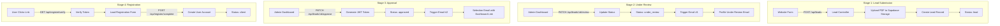

# Design Document: Consultation-to-Client Pipeline

## Overview

This design implements a 4-stage lead lifecycle pipeline for Apply Bureau, transforming website consultation submissions into registered clients. The system handles PDF resume uploads, status-triggered emails, secure registration tokens, and admin dashboard features for managing leads and contact requests.

The architecture extends the existing Express.js/Supabase backend with new routes, controllers, database schema changes, and email templates following strict brand guidelines.

## Architecture


```mermaid
flowchart TD
    subgraph "Stage 1: Lead Submission"
        A[Website Form] -->|POST /api/leads| B[Lead Controller]
        B --> C[Upload PDF to Supabase Storage]
        C --> D[Create Lead Record]
        D --> E[Status: lead]
    end
    
    subgraph "Stage 2: Under Review"
        F[Admin Dashboard] -->|PATCH /api/leads/:id/review| G[Update Status]
        G --> H[Status: under_review]
        H --> I[Trigger Email #1]
        I --> J[Profile Under Review Email]
    end
    
    subgraph "Stage 3: Approval"
        K[Admin Dashboard] -->|PATCH /api/leads/:id/approve| L[Generate JWT Token]
        L --> M[Status: approved]
        M --> N[Trigger Email #2]
        N --> O[Selection Email with Dashboard Link]
    end
    
    subgraph "Stage 4: Registration"
        P[User Clicks Link] -->|GET /api/register/verify| Q[Verify Token]
        Q --> R[Load Registration Form]
        R -->|POST /api/register/complete| S[Create User Account]
        S --> T[Status: client]
    end
```

## Components and Interfaces

### 1. Lead Controller (`controllers/leadController.js`)

Handles the 4-stage pipeline logic with status transitions and email triggers.

```javascript
// Lead submission with PDF upload
async submitLead(req, res) {
  // Input: { firstName, lastName, email, phone, subject, message, resume (file) }
  // Output: { id, status: 'lead', pdf_url }
}

// Admin marks lead as under review
async markUnderReview(req, res) {
  // Input: { id } (params)
  // Output: { id, status: 'under_review', reviewed_at, reviewed_by }
  // Side effect: Sends Email #1 (no dashboard link)
}

// Admin approves lead
async approveLead(req, res) {
  // Input: { id } (params)
  // Output: { id, status: 'approved', registration_token, approved_at, approved_by }
  // Side effect: Sends Email #2 (with dashboard link + warning)
}

// Verify registration token
async verifyRegistrationToken(req, res) {
  // Input: { token } (query)
  // Output: { valid: boolean, email, consultation_id }
}

// Complete registration
async completeRegistration(req, res) {
  // Input: { token, passcode, profile_data }
  // Output: { user_id, status: 'client' }
  // Side effect: Invalidates token, creates user account
}
```

### 2. Contact Request Controller (`controllers/contactRequestController.js`)

Handles general inquiries from the landing page.

```javascript
// Submit contact request
async submitContactRequest(req, res) {
  // Input: { firstName, lastName, email, phone?, subject, message }
  // Output: { id, status: 'new' }
}

// Get all contact requests (admin)
async getContactRequests(req, res) {
  // Input: { page, limit, status?, search? } (query)
  // Output: { data: [], total, page, limit }
}

// Update contact request status
async updateContactRequestStatus(req, res) {
  // Input: { id } (params), { status, admin_notes? } (body)
  // Output: { id, status, handled_at, handled_by }
}
```

### 3. Meeting Controller (`controllers/meetingController.js`)

Handles admin meeting scheduling.

```javascript
// Schedule meeting
async scheduleMeeting(req, res) {
  // Input: { lead_id, meeting_date, meeting_time, meeting_link }
  // Output: { id, meeting_date, meeting_time, meeting_link }
  // Side effect: Sends Meeting Scheduled email
}
```

### 4. Token Service (`utils/tokenService.js`)

Handles secure registration token generation and verification.

```javascript
// Generate registration token
function generateRegistrationToken(consultationId, email) {
  // Returns: signed JWT with 72h expiration
  // Payload: { consultation_id, email, exp, iat, type: 'registration' }
}

// Verify registration token
function verifyRegistrationToken(token) {
  // Returns: { valid: boolean, payload: { consultation_id, email } }
  // Checks: signature, expiration, token_used flag in DB
}

// Invalidate token after use
async function invalidateToken(consultationId) {
  // Updates: leads.token_used = true
}
```

### 5. Email Service Enhancement (`utils/email.js`)

Extended to support Base64 logo and new templates.

```javascript
// Logo as Base64 constant
const LOGO_BASE64 = 'data:image/png;base64,[ENCODED_STRING]';

// Send email with brand styling
async function sendBrandedEmail(to, templateName, variables) {
  // Injects: logo_base64, container_width: '800px'
  // Applies: dark background, white text styling
}
```

## Data Models

### Enhanced Leads Table Schema

```sql
-- Migration: Add pipeline fields to consultation_requests (renamed to leads)
ALTER TABLE consultation_requests RENAME TO leads;

ALTER TABLE leads ADD COLUMN IF NOT EXISTS status VARCHAR(20) DEFAULT 'lead' 
  CHECK (status IN ('lead', 'under_review', 'approved', 'client', 'rejected'));

ALTER TABLE leads ADD COLUMN IF NOT EXISTS pdf_url TEXT;
ALTER TABLE leads ADD COLUMN IF NOT EXISTS pdf_path TEXT;

-- Review stage fields
ALTER TABLE leads ADD COLUMN IF NOT EXISTS reviewed_at TIMESTAMPTZ;
ALTER TABLE leads ADD COLUMN IF NOT EXISTS reviewed_by UUID REFERENCES admins(id);

-- Approval stage fields  
ALTER TABLE leads ADD COLUMN IF NOT EXISTS approved_at TIMESTAMPTZ;
ALTER TABLE leads ADD COLUMN IF NOT EXISTS approved_by UUID REFERENCES admins(id);
ALTER TABLE leads ADD COLUMN IF NOT EXISTS registration_token TEXT;
ALTER TABLE leads ADD COLUMN IF NOT EXISTS token_expires_at TIMESTAMPTZ;
ALTER TABLE leads ADD COLUMN IF NOT EXISTS token_used BOOLEAN DEFAULT FALSE;

-- Registration stage fields
ALTER TABLE leads ADD COLUMN IF NOT EXISTS registered_at TIMESTAMPTZ;
ALTER TABLE leads ADD COLUMN IF NOT EXISTS user_id UUID REFERENCES users(id);

-- Profile fields (populated during registration)
ALTER TABLE leads ADD COLUMN IF NOT EXISTS age INTEGER;
ALTER TABLE leads ADD COLUMN IF NOT EXISTS linkedin_url TEXT;
ALTER TABLE leads ADD COLUMN IF NOT EXISTS profile_pic_url TEXT;
ALTER TABLE leads ADD COLUMN IF NOT EXISTS current_job VARCHAR(200);
ALTER TABLE leads ADD COLUMN IF NOT EXISTS target_job VARCHAR(200);
ALTER TABLE leads ADD COLUMN IF NOT EXISTS country VARCHAR(100);
ALTER TABLE leads ADD COLUMN IF NOT EXISTS location VARCHAR(200);
ALTER TABLE leads ADD COLUMN IF NOT EXISTS years_of_experience INTEGER;

-- Performance indexes
CREATE INDEX IF NOT EXISTS idx_leads_status ON leads(status);
CREATE INDEX IF NOT EXISTS idx_leads_email ON leads(email);
CREATE INDEX IF NOT EXISTS idx_leads_created_at ON leads(created_at);
CREATE INDEX IF NOT EXISTS idx_leads_token ON leads(registration_token) WHERE registration_token IS NOT NULL;
```

### Contact Requests Table Schema

```sql
CREATE TABLE IF NOT EXISTS contact_requests (
    id UUID PRIMARY KEY DEFAULT gen_random_uuid(),
    first_name VARCHAR(100) NOT NULL,
    last_name VARCHAR(100) NOT NULL,
    email VARCHAR(255) NOT NULL,
    phone VARCHAR(20),
    subject VARCHAR(500) NOT NULL,
    message TEXT NOT NULL,
    status VARCHAR(20) DEFAULT 'new' CHECK (status IN ('new', 'in_progress', 'handled', 'archived')),
    handled_by UUID REFERENCES admins(id),
    handled_at TIMESTAMPTZ,
    admin_notes TEXT,
    created_at TIMESTAMPTZ DEFAULT NOW(),
    updated_at TIMESTAMPTZ DEFAULT NOW()
);

-- Performance indexes
CREATE INDEX IF NOT EXISTS idx_contact_requests_email ON contact_requests(email);
CREATE INDEX IF NOT EXISTS idx_contact_requests_status ON contact_requests(status);
CREATE INDEX IF NOT EXISTS idx_contact_requests_created_at ON contact_requests(created_at);
```

### Meetings Table Schema

```sql
CREATE TABLE IF NOT EXISTS meetings (
    id UUID PRIMARY KEY DEFAULT gen_random_uuid(),
    lead_id UUID NOT NULL REFERENCES leads(id),
    admin_id UUID NOT NULL REFERENCES admins(id),
    meeting_date DATE NOT NULL,
    meeting_time TIME NOT NULL,
    meeting_link TEXT NOT NULL,
    status VARCHAR(20) DEFAULT 'scheduled' CHECK (status IN ('scheduled', 'completed', 'cancelled')),
    notes TEXT,
    created_at TIMESTAMPTZ DEFAULT NOW(),
    updated_at TIMESTAMPTZ DEFAULT NOW()
);

CREATE INDEX IF NOT EXISTS idx_meetings_lead_id ON meetings(lead_id);
CREATE INDEX IF NOT EXISTS idx_meetings_date ON meetings(meeting_date);
```

### Users Table Schema (for registered clients)

```sql
CREATE TABLE IF NOT EXISTS users (
    id UUID PRIMARY KEY DEFAULT gen_random_uuid(),
    lead_id UUID UNIQUE REFERENCES leads(id),
    email VARCHAR(255) UNIQUE NOT NULL,
    passcode_hash VARCHAR(255) NOT NULL,
    full_name VARCHAR(200) NOT NULL,
    role VARCHAR(20) DEFAULT 'client',
    is_active BOOLEAN DEFAULT TRUE,
    last_login TIMESTAMPTZ,
    created_at TIMESTAMPTZ DEFAULT NOW(),
    updated_at TIMESTAMPTZ DEFAULT NOW()
);

CREATE INDEX IF NOT EXISTS idx_users_email ON users(email);
CREATE INDEX IF NOT EXISTS idx_users_lead_id ON users(lead_id);
```

## Correctness Properties

*A property is a characteristic or behavior that should hold true across all valid executions of a system—essentially, a formal statement about what the system should do. Properties serve as the bridge between human-readable specifications and machine-verifiable correctness guarantees.*

### Property 1: Form Data Capture Completeness
*For any* form submission (full or simplified format), all provided fields SHALL be correctly parsed and stored in the database with no data loss.
**Validates: Requirements 1.1, 1.5**

### Property 2: Initial Status Invariant
*For any* newly created lead record, the status SHALL always be initialized to "lead".
**Validates: Requirements 1.3**

### Property 3: Cloud File Storage Round-Trip
*For any* uploaded PDF file, storing it in cloud storage and then retrieving it via the returned URL SHALL produce the identical file content.
**Validates: Requirements 1.2, 10.1, 10.4**

### Property 4: Status Transition Correctness
*For any* lead, status transitions SHALL only follow the valid state machine: lead → under_review → approved → client (or rejected at any stage).
**Validates: Requirements 2.1, 3.1, 4.6**

### Property 5: Email Triggering on Status Change
*For any* status transition to "under_review" or "approved", the corresponding email (Email #1 or Email #2) SHALL be triggered exactly once.
**Validates: Requirements 2.2, 3.3**

### Property 6: JWT Token Generation Correctness
*For any* approved lead, the generated registration token SHALL be a valid JWT containing consultation_id, email, and expiration timestamp (72 hours from creation).
**Validates: Requirements 3.2, 3.6, 11.1, 11.2**

### Property 7: Token Verification and Rejection
*For any* registration token, verification SHALL succeed only if the signature is valid, the token is not expired, and the token has not been previously used.
**Validates: Requirements 4.1, 4.2, 11.3**

### Property 8: Token Single-Use Enforcement
*For any* registration token that has been used to complete registration, subsequent verification attempts SHALL be rejected.
**Validates: Requirements 11.4, 11.5**

### Property 9: Dashboard Link Exclusivity
*For any* email sent by the system, the dashboard registration link SHALL appear ONLY in Email #2 (approval email) and in no other email template.
**Validates: Requirements 2.3, 3.4**

### Property 10: Email Styling Compliance
*For any* email generated by the system, the HTML SHALL contain: Base64-encoded logo, container width between 650-800px, dark background color, white (#FFFFFF) body text, and red (#FF0000) for warnings.
**Validates: Requirements 8.1, 8.2, 8.3, 8.4, 8.5, 8.6**

### Property 11: Pagination Correctness
*For any* paginated query with page P and limit L, the returned results SHALL contain at most L items and skip exactly (P-1)*L items from the total result set.
**Validates: Requirements 9.4, 6.4**

### Property 12: Audit Trail Recording
*For any* status transition (review or approval), the system SHALL record the timestamp and admin ID who performed the action.
**Validates: Requirements 2.4, 3.7**

## Error Handling

### Input Validation Errors
- Missing required fields: Return 400 with field-specific error messages
- Invalid email format: Return 400 with "Invalid email format"
- Invalid file type (non-PDF): Return 400 with "Only PDF files are allowed"
- File too large (>5MB): Return 400 with "File size exceeds 5MB limit"

### Token Errors
- Invalid token signature: Return 401 with "Invalid registration token"
- Expired token: Return 401 with "Registration token has expired"
- Already used token: Return 401 with "Registration token has already been used"

### State Transition Errors
- Invalid status transition: Return 400 with "Invalid status transition from {current} to {target}"
- Lead not found: Return 404 with "Lead not found"

### File Storage Errors
- Upload failure: Return 500 with "Failed to upload file" and log detailed error
- Storage quota exceeded: Return 507 with "Storage quota exceeded"

### Database Errors
- Constraint violation: Return 400 with sanitized error message
- Connection failure: Return 503 with "Service temporarily unavailable"

## Testing Strategy

### Unit Tests
- Token generation produces valid JWT structure
- Token verification correctly validates signature and expiration
- Form data parsing handles both full and simplified formats
- Status transition validation rejects invalid transitions
- Email template rendering includes all required variables

### Property-Based Tests (using fast-check)
- **Property 1**: Generate random form data → verify all fields stored correctly
- **Property 2**: Create N leads → verify all have status "lead"
- **Property 3**: Upload random PDF → download → compare checksums
- **Property 4**: Generate random status transition sequences → verify only valid ones succeed
- **Property 6**: Generate tokens → verify JWT structure and payload
- **Property 7**: Generate valid/invalid/expired tokens → verify correct acceptance/rejection
- **Property 8**: Use token → attempt reuse → verify rejection
- **Property 10**: Render all email templates → verify styling compliance
- **Property 11**: Generate random pagination params → verify correct result counts

### Integration Tests
- Full pipeline flow: Submit lead → Review → Approve → Register → Verify client status
- Email delivery verification with test SMTP server
- File upload/download round-trip with Supabase Storage
- Admin dashboard API pagination with large datasets

### Test Configuration
- Minimum 100 iterations per property test
- Test database with seeded data for pagination tests
- Mock email service for unit tests, real service for integration tests
