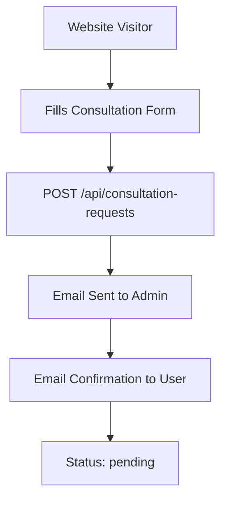
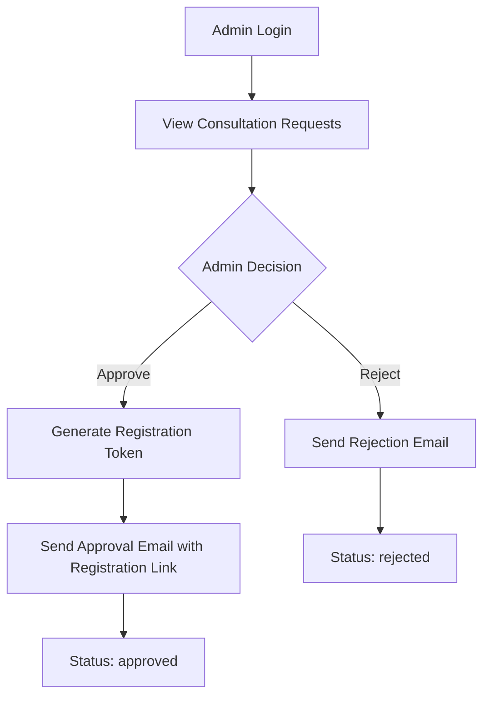
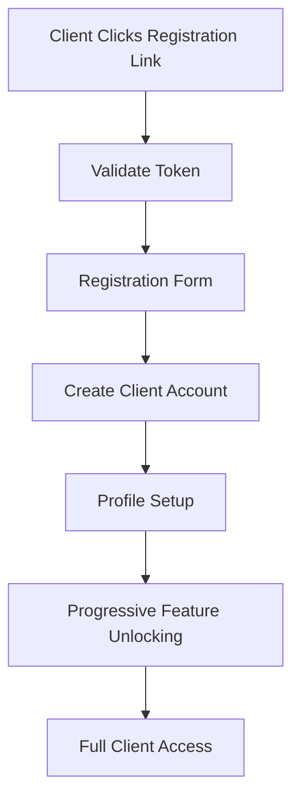

# Apply Bureau Frontend Integration Guide

This comprehensive guide explains the complete system flow and provides practical examples for frontend integration with the Apply Bureau backend API.

## 🎯 System Overview

Apply Bureau is a consultation-to-client pipeline system that transforms website visitors into fully onboarded clients through a structured workflow:

```
Website Form → Consultation Request → Admin Review → Client Registration → Profile Completion → Active Client
```

## 🏗️ System Architecture

### Core Components
1. **Public Website** - Consultation request forms
2. **Admin Dashboard** - Business management interface
3. **Client Dashboard** - Client-facing progress tracking
4. **Email System** - Automated notifications
5. **Authentication System** - JWT-based security

### User Roles
- **Public Users** - Can submit consultation requests
- **Admins** - Manage consultations and clients
- **Clients** - Registered users with access to dashboard

## 🔄 Complete System Flow

### Phase 1: Initial Consultation Request


### Phase 2: Admin Review Process


### Phase 3: Client Registration & Onboarding


## 📡 API Endpoints Reference

### Base URL
```
Production: https://your-backend-domain.com
Development: http://localhost:3000
```

### Authentication
All protected endpoints require JWT token in Authorization header:
```javascript
headers: {
  'Authorization': `Bearer ${token}`,
  'Content-Type': 'application/json'
}
```

## 🌐 Frontend Implementation Examples

### 1. Public Consultation Form

**Frontend Form Component:**
```jsx
// ConsultationForm.jsx
import React, { useState } from 'react';

const ConsultationForm = () => {
  const [formData, setFormData] = useState({
    full_name: '',
    email: '',
    phone: '',
    linkedin_url: '',
    role_targets: '',
    location_preferences: '',
    minimum_salary: '',
    target_market: '',
    employment_status: 'Currently Employed',
    package_interest: 'Tier 1',
    area_of_concern: '',
    consultation_window: ''
  });

  const [loading, setLoading] = useState(false);
  const [success, setSuccess] = useState(false);

  const handleSubmit = async (e) => {
    e.preventDefault();
    setLoading(true);

    try {
      const response = await fetch('/api/consultation-requests', {
        method: 'POST',
        headers: {
          'Content-Type': 'application/json',
        },
        body: JSON.stringify(formData)
      });

      const result = await response.json();

      if (response.ok) {
        setSuccess(true);
        // Show success message with consultation ID
        console.log('Consultation submitted:', result.id);
      } else {
        throw new Error(result.error || 'Submission failed');
      }
    } catch (error) {
      console.error('Error:', error);
      // Show error message to user
    } finally {
      setLoading(false);
    }
  };

  return (
    <form onSubmit={handleSubmit}>
      {/* Form fields */}
      <input
        type="text"
        placeholder="Full Name"
        value={formData.full_name}
        onChange={(e) => setFormData({...formData, full_name: e.target.value})}
        required
      />
      
      <input
        type="email"
        placeholder="Email"
        value={formData.email}
        onChange={(e) => setFormData({...formData, email: e.target.value})}
        required
      />

      {/* Add all other fields similarly */}
      
      <button type="submit" disabled={loading}>
        {loading ? 'Submitting...' : 'Submit Consultation Request'}
      </button>

      {success && (
        <div className="success-message">
          Consultation request submitted successfully! 
          You'll receive an email confirmation shortly.
        </div>
      )}
    </form>
  );
};
```

**API Call Example:**
```javascript
// POST /api/consultation-requests
const submitConsultation = async (formData) => {
  const response = await fetch('/api/consultation-requests', {
    method: 'POST',
    headers: {
      'Content-Type': 'application/json',
    },
    body: JSON.stringify({
      full_name: "John Doe",
      email: "john.doe@example.com",
      phone: "+1-555-123-4567",
      linkedin_url: "https://linkedin.com/in/johndoe",
      role_targets: "Software Engineer, Full Stack Developer",
      location_preferences: "San Francisco, Remote",
      minimum_salary: "$120,000",
      target_market: "Tech Startups",
      employment_status: "Currently Employed",
      package_interest: "Tier 2",
      area_of_concern: "Need help with interview preparation and salary negotiation",
      consultation_window: "Next 2 weeks"
    })
  });

  return await response.json();
};

// Expected Response:
{
  "id": "253cecd4-be4d-4c9f-a7ed-5a56698a60eb",
  "status": "pending",
  "message": "Consultation request received successfully"
}
```

### 2. Admin Dashboard Implementation

**Admin Login:**
```jsx
// AdminLogin.jsx
const AdminLogin = () => {
  const [credentials, setCredentials] = useState({
    email: '',
    password: ''
  });

  const handleLogin = async (e) => {
    e.preventDefault();
    
    try {
      const response = await fetch('/api/auth/login', {
        method: 'POST',
        headers: {
          'Content-Type': 'application/json',
        },
        body: JSON.stringify(credentials)
      });

      const result = await response.json();

      if (response.ok) {
        // Store token in localStorage or secure storage
        localStorage.setItem('adminToken', result.token);
        // Redirect to admin dashboard
        window.location.href = '/admin/dashboard';
      } else {
        throw new Error(result.error);
      }
    } catch (error) {
      console.error('Login failed:', error);
    }
  };

  return (
    <form onSubmit={handleLogin}>
      <input
        type="email"
        placeholder="Admin Email"
        value={credentials.email}
        onChange={(e) => setCredentials({...credentials, email: e.target.value})}
        required
      />
      <input
        type="password"
        placeholder="Password"
        value={credentials.password}
        onChange={(e) => setCredentials({...credentials, password: e.target.value})}
        required
      />
      <button type="submit">Login</button>
    </form>
  );
};
```

**Admin Consultation Management:**
```jsx
// AdminConsultations.jsx
const AdminConsultations = () => {
  const [consultations, setConsultations] = useState([]);
  const [loading, setLoading] = useState(true);

  useEffect(() => {
    fetchConsultations();
  }, []);

  const fetchConsultations = async () => {
    try {
      const token = localStorage.getItem('adminToken');
      const response = await fetch('/api/consultation-requests', {
        headers: {
          'Authorization': `Bearer ${token}`,
          'Content-Type': 'application/json'
        }
      });

      const result = await response.json();
      setConsultations(result.consultations || []);
    } catch (error) {
      console.error('Error fetching consultations:', error);
    } finally {
      setLoading(false);
    }
  };

  const approveConsultation = async (consultationId) => {
    try {
      const token = localStorage.getItem('adminToken');
      const response = await fetch(`/api/consultation-requests/${consultationId}`, {
        method: 'PATCH',
        headers: {
          'Authorization': `Bearer ${token}`,
          'Content-Type': 'application/json'
        },
        body: JSON.stringify({
          pipeline_status: 'approved',
          admin_notes: 'Great candidate with strong background. Approved for Tier 2 service.'
        })
      });

      const result = await response.json();
      
      if (response.ok) {
        // Refresh consultations list
        fetchConsultations();
        console.log('Registration token:', result.registration_token);
      }
    } catch (error) {
      console.error('Error approving consultation:', error);
    }
  };

  const rejectConsultation = async (consultationId) => {
    try {
      const token = localStorage.getItem('adminToken');
      const response = await fetch(`/api/consultation-requests/${consultationId}`, {
        method: 'PATCH',
        headers: {
          'Authorization': `Bearer ${token}`,
          'Content-Type': 'application/json'
        },
        body: JSON.stringify({
          pipeline_status: 'rejected',
          rejection_reason: 'Not a good fit for our current service offerings.'
        })
      });

      if (response.ok) {
        fetchConsultations();
      }
    } catch (error) {
      console.error('Error rejecting consultation:', error);
    }
  };

  return (
    <div className="admin-consultations">
      <h2>Consultation Requests</h2>
      
      {loading ? (
        <div>Loading...</div>
      ) : (
        <div className="consultations-list">
          {consultations.map(consultation => (
            <div key={consultation.id} className="consultation-card">
              <h3>{consultation.full_name}</h3>
              <p>Email: {consultation.email}</p>
              <p>Status: {consultation.pipeline_status}</p>
              <p>Package Interest: {consultation.package_interest}</p>
              <p>Target Roles: {consultation.role_targets}</p>
              
              {consultation.pipeline_status === 'pending' && (
                <div className="actions">
                  <button 
                    onClick={() => approveConsultation(consultation.id)}
                    className="approve-btn"
                  >
                    Approve
                  </button>
                  <button 
                    onClick={() => rejectConsultation(consultation.id)}
                    className="reject-btn"
                  >
                    Reject
                  </button>
                </div>
              )}
            </div>
          ))}
        </div>
      )}
    </div>
  );
};
```

### 3. Client Registration Flow

**Registration Token Validation:**
```jsx
// ClientRegistration.jsx
import { useParams } from 'react-router-dom';

const ClientRegistration = () => {
  const { token } = useParams(); // Get token from URL
  const [tokenValid, setTokenValid] = useState(false);
  const [consultationData, setConsultationData] = useState(null);
  const [registrationData, setRegistrationData] = useState({
    password: '',
    confirmPassword: ''
  });

  useEffect(() => {
    validateToken();
  }, [token]);

  const validateToken = async () => {
    try {
      const response = await fetch(`/api/consultation-requests/validate-token/${token}`);
      const result = await response.json();

      if (response.ok && result.valid) {
        setTokenValid(true);
        setConsultationData(result.consultation);
      } else {
        // Token is invalid or expired
        console.error('Invalid token:', result.error);
      }
    } catch (error) {
      console.error('Token validation error:', error);
    }
  };

  const completeRegistration = async (e) => {
    e.preventDefault();

    if (registrationData.password !== registrationData.confirmPassword) {
      alert('Passwords do not match');
      return;
    }

    try {
      const response = await fetch('/api/consultation-requests/register', {
        method: 'POST',
        headers: {
          'Content-Type': 'application/json',
        },
        body: JSON.stringify({
          token: token,
          password: registrationData.password
        })
      });

      const result = await response.json();

      if (response.ok) {
        // Store client token
        localStorage.setItem('clientToken', result.token);
        
        // Redirect to profile setup
        window.location.href = result.redirect_to || '/client/profile-setup';
      } else {
        throw new Error(result.error);
      }
    } catch (error) {
      console.error('Registration error:', error);
    }
  };

  if (!tokenValid) {
    return (
      <div className="invalid-token">
        <h2>Invalid or Expired Registration Link</h2>
        <p>This registration link is no longer valid. Please contact support.</p>
      </div>
    );
  }

  return (
    <div className="client-registration">
      <h2>Complete Your Registration</h2>
      
      {consultationData && (
        <div className="consultation-info">
          <h3>Welcome, {consultationData.full_name}!</h3>
          <p>Email: {consultationData.email}</p>
          <p>Registration expires: {new Date(consultationData.expires_at).toLocaleDateString()}</p>
        </div>
      )}

      <form onSubmit={completeRegistration}>
        <div className="form-group">
          <label>Password:</label>
          <input
            type="password"
            value={registrationData.password}
            onChange={(e) => setRegistrationData({
              ...registrationData, 
              password: e.target.value
            })}
            required
            minLength={8}
          />
        </div>

        <div className="form-group">
          <label>Confirm Password:</label>
          <input
            type="password"
            value={registrationData.confirmPassword}
            onChange={(e) => setRegistrationData({
              ...registrationData, 
              confirmPassword: e.target.value
            })}
            required
          />
        </div>

        <button type="submit">Complete Registration</button>
      </form>
    </div>
  );
};
```

### 4. Client Dashboard Implementation

**Profile Completion Tracking:**
```jsx
// ClientProfile.jsx
const ClientProfile = () => {
  const [profile, setProfile] = useState(null);
  const [completion, setCompletion] = useState(null);
  const [loading, setLoading] = useState(true);

  useEffect(() => {
    fetchProfile();
  }, []);

  const fetchProfile = async () => {
    try {
      const token = localStorage.getItem('clientToken');
      const response = await fetch('/api/client/profile', {
        headers: {
          'Authorization': `Bearer ${token}`,
          'Content-Type': 'application/json'
        }
      });

      const result = await response.json();
      
      if (response.ok) {
        setProfile(result.profile);
        setCompletion(result.completion);
      }
    } catch (error) {
      console.error('Error fetching profile:', error);
    } finally {
      setLoading(false);
    }
  };

  const updateProfile = async (updatedData) => {
    try {
      const token = localStorage.getItem('clientToken');
      const response = await fetch('/api/client/profile', {
        method: 'PATCH',
        headers: {
          'Authorization': `Bearer ${token}`,
          'Content-Type': 'application/json'
        },
        body: JSON.stringify(updatedData)
      });

      const result = await response.json();
      
      if (response.ok) {
        setProfile(result.profile);
        setCompletion(result.completion);
      }
    } catch (error) {
      console.error('Error updating profile:', error);
    }
  };

  if (loading) return <div>Loading...</div>;

  return (
    <div className="client-profile">
      <div className="completion-status">
        <h3>Profile Completion: {completion?.percentage}%</h3>
        
        <div className="progress-bar">
          <div 
            className="progress-fill" 
            style={{ width: `${completion?.percentage}%` }}
          ></div>
        </div>

        <div className="feature-unlocks">
          <div className={completion?.features_unlocked?.application_tracking ? 'unlocked' : 'locked'}>
            📊 Application Tracking {completion?.percentage >= 40 ? '✓' : '(40% required)'}
          </div>
          <div className={completion?.features_unlocked?.interview_hub ? 'unlocked' : 'locked'}>
            🎯 Interview Hub {completion?.percentage >= 60 ? '✓' : '(60% required)'}
          </div>
          <div className={completion?.features_unlocked?.document_vault ? 'unlocked' : 'locked'}>
            📁 Document Vault {completion?.percentage >= 80 ? '✓' : '(80% required)'}
          </div>
          <div className={completion?.features_unlocked?.full_access ? 'unlocked' : 'locked'}>
            🚀 Full Access {completion?.is_complete ? '✓' : '(100% required)'}
          </div>
        </div>
      </div>

      <div className="profile-form">
        <h3>Complete Your Profile</h3>
        
        {completion?.missing_fields?.length > 0 && (
          <div className="missing-fields">
            <h4>Missing Required Fields:</h4>
            <ul>
              {completion.missing_fields.map(field => (
                <li key={field}>{field.replace('consultation_data.', '').replace('_', ' ')}</li>
              ))}
            </ul>
          </div>
        )}

        {/* Profile form fields */}
        <ProfileForm 
          profile={profile} 
          onUpdate={updateProfile}
        />
      </div>
    </div>
  );
};
```

**Client Dashboard Overview:**
```jsx
// ClientDashboard.jsx
const ClientDashboard = () => {
  const [dashboardData, setDashboardData] = useState(null);
  const [notifications, setNotifications] = useState([]);

  useEffect(() => {
    fetchDashboardData();
    fetchNotifications();
  }, []);

  const fetchDashboardData = async () => {
    try {
      const token = localStorage.getItem('clientToken');
      const response = await fetch('/api/client/dashboard', {
        headers: {
          'Authorization': `Bearer ${token}`,
          'Content-Type': 'application/json'
        }
      });

      const result = await response.json();
      setDashboardData(result);
    } catch (error) {
      console.error('Error fetching dashboard:', error);
    }
  };

  const fetchNotifications = async () => {
    try {
      const token = localStorage.getItem('clientToken');
      const response = await fetch('/api/client/dashboard/notifications', {
        headers: {
          'Authorization': `Bearer ${token}`,
          'Content-Type': 'application/json'
        }
      });

      const result = await response.json();
      setNotifications(result.notifications || []);
    } catch (error) {
      console.error('Error fetching notifications:', error);
    }
  };

  return (
    <div className="client-dashboard">
      <h2>Welcome to Your Dashboard</h2>
      
      {dashboardData && (
        <div className="dashboard-overview">
          <div className="stats-grid">
            <div className="stat-card">
              <h3>Profile Completion</h3>
              <div className="stat-value">{dashboardData.profile_completion}%</div>
            </div>
            
            <div className="stat-card">
              <h3>Applications This Week</h3>
              <div className="stat-value">
                {dashboardData.applications_this_week} / {dashboardData.weekly_target}
              </div>
            </div>
            
            <div className="stat-card">
              <h3>Interview Prep Sessions</h3>
              <div className="stat-value">{dashboardData.interview_sessions}</div>
            </div>
          </div>

          <div className="quick-actions">
            <button onClick={() => window.location.href = '/client/profile'}>
              Complete Profile
            </button>
            <button onClick={() => window.location.href = '/client/applications'}>
              Track Applications
            </button>
            <button onClick={() => window.location.href = '/client/interviews'}>
              Schedule Interview Prep
            </button>
          </div>
        </div>
      )}

      <div className="notifications-section">
        <h3>Recent Notifications</h3>
        {notifications.length > 0 ? (
          <div className="notifications-list">
            {notifications.map(notification => (
              <div key={notification.id} className="notification-item">
                <h4>{notification.title}</h4>
                <p>{notification.message}</p>
                <small>{new Date(notification.created_at).toLocaleDateString()}</small>
              </div>
            ))}
          </div>
        ) : (
          <p>No new notifications</p>
        )}
      </div>
    </div>
  );
};
```

## 🔐 Authentication & Security

### JWT Token Management
```javascript
// auth.js - Authentication utility
class AuthManager {
  static setToken(token, userType) {
    localStorage.setItem(`${userType}Token`, token);
  }

  static getToken(userType) {
    return localStorage.getItem(`${userType}Token`);
  }

  static removeToken(userType) {
    localStorage.removeItem(`${userType}Token`);
  }

  static isAuthenticated(userType) {
    const token = this.getToken(userType);
    if (!token) return false;

    try {
      const payload = JSON.parse(atob(token.split('.')[1]));
      return payload.exp > Date.now() / 1000;
    } catch {
      return false;
    }
  }

  static async makeAuthenticatedRequest(url, options = {}, userType = 'client') {
    const token = this.getToken(userType);
    
    return fetch(url, {
      ...options,
      headers: {
        ...options.headers,
        'Authorization': `Bearer ${token}`,
        'Content-Type': 'application/json'
      }
    });
  }
}

// Usage example:
const response = await AuthManager.makeAuthenticatedRequest(
  '/api/client/profile',
  { method: 'GET' },
  'client'
);
```

### Protected Route Component
```jsx
// ProtectedRoute.jsx
const ProtectedRoute = ({ children, userType = 'client' }) => {
  const [isAuthenticated, setIsAuthenticated] = useState(false);
  const [loading, setLoading] = useState(true);

  useEffect(() => {
    checkAuthentication();
  }, []);

  const checkAuthentication = async () => {
    const authenticated = AuthManager.isAuthenticated(userType);
    
    if (authenticated) {
      // Verify token with server
      try {
        const response = await AuthManager.makeAuthenticatedRequest(
          '/api/auth/verify',
          { method: 'GET' },
          userType
        );
        
        setIsAuthenticated(response.ok);
      } catch {
        setIsAuthenticated(false);
      }
    }
    
    setLoading(false);
  };

  if (loading) {
    return <div>Loading...</div>;
  }

  if (!isAuthenticated) {
    return <Navigate to={`/${userType}/login`} />;
  }

  return children;
};

// Usage:
<ProtectedRoute userType="admin">
  <AdminDashboard />
</ProtectedRoute>

<ProtectedRoute userType="client">
  <ClientDashboard />
</ProtectedRoute>
```

## 📧 Email Integration

The system automatically sends emails at key points. Frontend should inform users about expected emails:

### Email Notifications Timeline
```jsx
// EmailNotificationInfo.jsx
const EmailNotificationInfo = ({ stage }) => {
  const emailInfo = {
    consultation_submitted: {
      title: "Confirmation Email Sent",
      message: "You'll receive a confirmation email shortly with your consultation request details.",
      timeline: "Within 5 minutes"
    },
    under_review: {
      title: "Review Notification",
      message: "We'll email you when your consultation is under review.",
      timeline: "Within 24-48 hours"
    },
    approved: {
      title: "Registration Link",
      message: "Check your email for a secure registration link to complete your account setup.",
      timeline: "Immediately after approval"
    },
    registered: {
      title: "Welcome Email",
      message: "You'll receive a welcome email with next steps and dashboard access.",
      timeline: "Immediately after registration"
    }
  };

  const info = emailInfo[stage];
  
  return (
    <div className="email-notification-info">
      <h4>{info.title}</h4>
      <p>{info.message}</p>
      <small>Expected: {info.timeline}</small>
    </div>
  );
};
```

## 🚨 Error Handling

### Comprehensive Error Handler
```javascript
// errorHandler.js
class APIErrorHandler {
  static handle(error, response) {
    const errorMap = {
      400: 'Invalid request. Please check your input.',
      401: 'Authentication required. Please log in.',
      403: 'Access denied. You don\'t have permission for this action.',
      404: 'Resource not found.',
      409: 'Conflict. This resource already exists.',
      422: 'Validation failed. Please check your input.',
      429: 'Too many requests. Please try again later.',
      500: 'Server error. Please try again later.'
    };

    const message = response?.error || errorMap[response?.status] || 'An unexpected error occurred.';
    
    return {
      message,
      status: response?.status,
      details: response?.details || null
    };
  }

  static async handleResponse(response) {
    const data = await response.json().catch(() => ({}));
    
    if (!response.ok) {
      const error = this.handle(null, { ...data, status: response.status });
      throw new Error(error.message);
    }
    
    return data;
  }
}

// Usage:
try {
  const response = await fetch('/api/client/profile');
  const data = await APIErrorHandler.handleResponse(response);
  // Handle success
} catch (error) {
  console.error('API Error:', error.message);
  // Show user-friendly error message
}
```

## 🎨 UI/UX Recommendations

### Loading States
```jsx
// LoadingSpinner.jsx
const LoadingSpinner = ({ message = "Loading..." }) => (
  <div className="loading-spinner">
    <div className="spinner"></div>
    <p>{message}</p>
  </div>
);

// Usage in forms:
{loading && <LoadingSpinner message="Submitting consultation..." />}
```

### Success/Error Messages
```jsx
// StatusMessage.jsx
const StatusMessage = ({ type, message, onClose }) => (
  <div className={`status-message ${type}`}>
    <span>{message}</span>
    {onClose && <button onClick={onClose}>×</button>}
  </div>
);

// Usage:
{success && (
  <StatusMessage 
    type="success" 
    message="Consultation submitted successfully!" 
    onClose={() => setSuccess(false)}
  />
)}
```

### Progress Indicators
```jsx
// ProgressBar.jsx
const ProgressBar = ({ percentage, label }) => (
  <div className="progress-container">
    <div className="progress-label">{label}: {percentage}%</div>
    <div className="progress-bar">
      <div 
        className="progress-fill" 
        style={{ width: `${percentage}%` }}
      ></div>
    </div>
  </div>
);
```

## 🔄 Real-time Updates (Optional)

For real-time notifications, you can implement WebSocket connection:

```javascript
// websocket.js
class WebSocketManager {
  constructor(userType, userId) {
    this.userType = userType;
    this.userId = userId;
    this.ws = null;
  }

  connect() {
    const token = AuthManager.getToken(this.userType);
    this.ws = new WebSocket(`ws://localhost:30001?token=${token}`);
    
    this.ws.onmessage = (event) => {
      const data = JSON.parse(event.data);
      this.handleMessage(data);
    };
  }

  handleMessage(data) {
    switch (data.type) {
      case 'consultation_approved':
        // Show notification about approval
        break;
      case 'profile_completion_reminder':
        // Show reminder to complete profile
        break;
      default:
        console.log('Unknown message type:', data.type);
    }
  }

  disconnect() {
    if (this.ws) {
      this.ws.close();
    }
  }
}
```

## 📱 Mobile Responsiveness

Ensure all components are mobile-friendly:

```css
/* Mobile-first responsive design */
.consultation-form {
  max-width: 100%;
  padding: 1rem;
}

@media (min-width: 768px) {
  .consultation-form {
    max-width: 600px;
    padding: 2rem;
  }
}

.dashboard-grid {
  display: grid;
  grid-template-columns: 1fr;
  gap: 1rem;
}

@media (min-width: 1024px) {
  .dashboard-grid {
    grid-template-columns: 2fr 1fr;
  }
}
```

## 🧪 Testing Integration

### API Testing Utilities
```javascript
// testUtils.js
export const mockAPIResponse = (data, status = 200) => {
  global.fetch = jest.fn(() =>
    Promise.resolve({
      ok: status >= 200 && status < 300,
      status,
      json: () => Promise.resolve(data),
    })
  );
};

// Test example:
test('should submit consultation form', async () => {
  mockAPIResponse({
    id: 'test-id',
    status: 'pending',
    message: 'Success'
  });

  render(<ConsultationForm />);
  
  // Fill form and submit
  fireEvent.click(screen.getByText('Submit'));
  
  await waitFor(() => {
    expect(screen.getByText('Success')).toBeInTheDocument();
  });
});
```

## 🚀 Deployment Considerations

### Environment Configuration
```javascript
// config.js
const config = {
  development: {
    API_BASE_URL: 'http://localhost:3000',
    WS_URL: 'ws://localhost:30001'
  },
  production: {
    API_BASE_URL: 'https://your-backend-domain.com',
    WS_URL: 'wss://your-backend-domain.com:30001'
  }
};

export default config[process.env.NODE_ENV || 'development'];
```

### Build Optimization
```javascript
// Lazy load dashboard components
const AdminDashboard = lazy(() => import('./components/AdminDashboard'));
const ClientDashboard = lazy(() => import('./components/ClientDashboard'));

// Use Suspense for loading states
<Suspense fallback={<LoadingSpinner />}>
  <AdminDashboard />
</Suspense>
```

## 📞 Support & Troubleshooting

### Common Issues & Solutions

1. **Token Expiration**: Implement automatic token refresh
2. **Network Errors**: Add retry logic for failed requests
3. **Form Validation**: Use client-side validation matching backend rules
4. **File Uploads**: Handle large file uploads with progress indicators

### Debug Mode
```javascript
// Enable debug logging in development
if (process.env.NODE_ENV === 'development') {
  window.debugAPI = {
    getToken: (type) => AuthManager.getToken(type),
    testEndpoint: async (url) => {
      const response = await fetch(url);
      return response.json();
    }
  };
}
```

This comprehensive guide provides everything the frontend team needs to successfully integrate with the Apply Bureau backend system. Each example includes practical code that can be adapted to your specific frontend framework and design requirements.